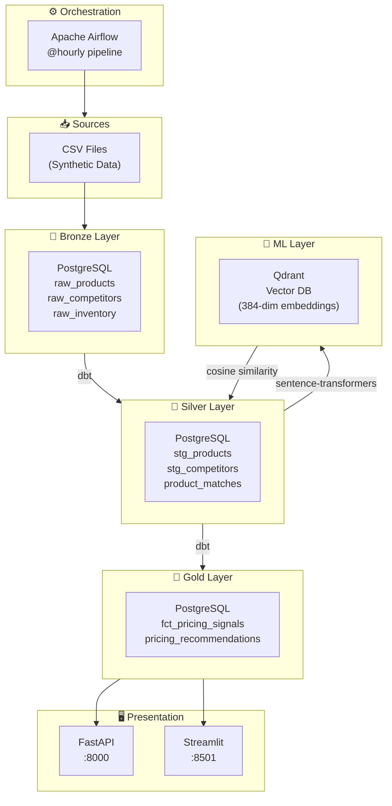

# Dynamic Pricing System for E-commerce

> Motor de pricing dinámico end-to-end que reacciona cada hora a cambios en competencia, stock y demanda. Demuestra competencias de **Data Engineering**, **ML Engineering** y **MLOps**.

## Arquitectura



## Stack Tecnológico

| Capa | Tecnología | Justificación |
|------|-----------|---------------|
| Orquestación | **Apache Airflow** | Estándar de industria; DAGs con dependencias explícitas |
| Base de Datos | **PostgreSQL 15** | Universal; soporta analytics y transacciones |
| Vector DB | **Qdrant** | Open source, API REST limpia, local-friendly |
| Transformación | **dbt Core** | Separa lógica de negocio del código Python; lineage automático |
| API | **FastAPI** | Async, auto-documentada, type-safe con Pydantic |
| Dashboard | **Streamlit** | Rápido de construir, excelente para demos |
| ML/NLP | **sentence-transformers** | No requiere GPU; modelos pre-entrenados de calidad |
| Calidad | **dbt tests + validaciones Python** | Data contracts explícitos |
| Contenedores | **Docker + Compose** | Reproducibilidad absoluta |

## Inicio Rápido

**Prerequisitos:** Docker 24+, Docker Compose 2.20+, Git, 8GB RAM libres

```bash
# 1. Clonar repositorio
git clone https://github.com/tuusuario/dynamic-pricing-de.git
cd dynamic-pricing-de

# 2. Configurar variables de entorno
cp .env.example .env
# (Los valores por defecto funcionan para desarrollo local)

# 3. Levantar stack completo
docker-compose up -d

# 4. Esperar inicialización (~2 minutos)
docker-compose ps

# 5. Generar datos e inicializar pipeline
docker exec pricing_airflow_scheduler \
  airflow dags trigger dynamic_pricing_pipeline

# 6. Acceder a los servicios
# Airflow UI:    http://localhost:8080  (admin/admin)
# FastAPI docs:  http://localhost:8000/docs
# Dashboard:     http://localhost:8501
# MinIO:         http://localhost:9001  (minioadmin/minioadmin123)
```

## Estructura del Repositorio

```
dynamic-pricing-de/
├── src/                    # Código fuente Python
│   ├── ingestion/          # Carga de datos a Bronze
│   ├── matching/           # Embeddings + matching NLP
│   ├── pricing/            # Motor de pricing
│   └── api/                # FastAPI application
├── dbt/                    # Modelos dbt (Bronze/Silver/Gold)
├── airflow/dags/           # DAGs de orquestación
├── dashboard/              # Streamlit app
├── scripts/                # Utilidades (generación de datos, verificación)
├── terraform/              # Infraestructura como código (AWS)
├── docker/                 # Dockerfiles custom
├── tests/                  # Tests unitarios
├── config/                 # Configuración del motor de pricing
├── notebooks/              # EDA y análisis exploratorio
└── data/                   # Datos raw y procesados (gitignored)
```

## Endpoints de la API

```bash
# Health check
GET  /health

# Sugerencia individual
GET  /pricing/suggestion/{product_id}

# Consulta masiva con filtros
GET  /pricing/batch?category=Audio&action=decrease&limit=50

# Matches pendientes de revisión
GET  /matches/pending
```

## Decisiones Técnicas Clave

### ¿Por qué Qdrant y no Pinecone?
Para un portfolio local, Qdrant es preferible: open source, corre en Docker sin API key, y tiene una API REST equivalente. La migración a Pinecone/Weaviate managed requeriría solo cambiar el cliente, no la lógica.

### ¿Por qué reglas de negocio y no ML black-box?
El pricing necesita explicabilidad para el equipo comercial. *"El precio sube porque la demanda aumentó 30% y el stock está en nivel crítico"* es accionable. Un modelo de gradient boosting con 50 features no lo es.

### ¿Por qué dbt y no SQL puro en Python?
dbt separa la lógica de negocio del código Python, genera documentación automática, y permite que analistas de negocio entiendan las transformaciones sin leer Python. El lineage automático de Bronze → Silver → Gold es un activo en auditorías.

## Escalabilidad

Para pasar de 1,000 a 1,000,000 SKUs:
- **Qdrant** → Pinecone/Weaviate managed (cambio de cliente)
- **PostgreSQL** → Redshift/BigQuery (cambio de profile en dbt)
- **Pandas** → Spark/Polars para el motor de pricing en batch
- **Airflow LocalExecutor** → CeleryExecutor con workers distribuidos
- **API** → Cachear con Redis, rate limiting, autoscaling en ECS/GKE

## Tests

```bash
# Ejecutar tests unitarios del motor de pricing
pytest tests/test_pricing_engine.py -v

# Con coverage
pytest tests/ --cov=src --cov-report=html

# Verificación completa del sistema
chmod +x scripts/verify_setup.sh
./scripts/verify_setup.sh
```

## Pipeline Maestro

El DAG `dynamic_pricing_pipeline` ejecuta cada hora:

1. **Ingesta** → Regenera datos sintéticos y carga a Bronze
2. **Validación** → Data quality checks (falla el DAG si no pasa)
3. **dbt** → Transformaciones Bronze → Silver → Gold
4. **Embeddings** → Vectorización de productos en Qdrant
5. **Matching** → Empareja productos propios vs competencia (cosine similarity)
6. **Pricing** → Calcula precios sugeridos con reglas explicables

**SLA:** 10 minutos máximo por ejecución.

---

*Construido como proyecto de portafolio para demostrar competencias en Data Engineering y MLOps.*
